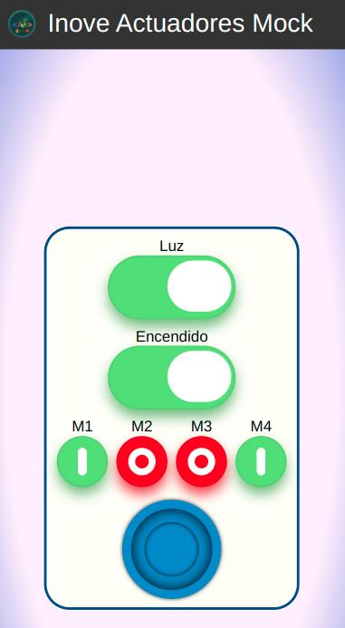

# Ejercicios de Profundizacion

En esta práctica utilizaremos el simulador de drone "drone emulado" junto a la aplicación de "actuadores_mock" que dispone dentro de la carpeta de profundización

Logearse desde VM y obtener cual es la dirección IP del dispositivo:
```sh
$ ifconfig
```

Abrir el Visual Studio Code y conectarse de forma remota al dispositivo. Trabajaremos sobre la carpeta recientemente creada para esta clase.

Desde ssh conectado a la VM, en la carpeta "repos" clonar el repositorio del simulador de drone:
```sh
$ git clone https://github.com/InoveAlumnos/drone_emulado_iot
```

Topicos que soporta este mock drone emulado:
|             |          |      | datos ejemplo
| ----------  | -------- | -----| -----
|  actuadores | luces    | 1    |  0/1
|  actuadores | volar    |      |  0/1
|  actuadores | motores  | 1..4 |  0/1
|  actuadores | joystick |      |  {"x": 0.8, "y": 0.3}

### 1 - Lanzar el simulador drone emulado
Desde ssh conectado a la VM, ingresar a la carpeta clonada del "drone_emulado" y lanzar la aplicación:
```sh
$ python3 app.py
```

Ingresar a su explorador web e ingresar a al aplicación del drone:
```
http://<ip_VM>:5009
```

### 2 - Lanzar el simulador actuadores mock
Abrir otra terminal ssh conectandose a la VM, ingresar a la carpeta clonada de los ejercicios de profundización de esta clase. Ingresar a la carpeta de "actuadores_mock" y lanzar la aplicación:
```sh
$ python3 app.py
```

Ingresar a su explorador web e ingresar a al aplicación del drone:
```
http://<ip_VM>:5007
```

Deberá ver una pantalla como la siguiente:



### 3 - Modificar el simulador de actuadores_mock
Deberá modificar el app.py a fin de implementar las funcionalidades faltantes. Para ello busque en el archivo todos los comentarios referidos a "Alumno". 
- El objetivo que se desea lograr es que el simulador de "actuadores_mock" se conecte con éxito al simulador "drone_emulado".
- Cuando utilice los actuadores en el nuevo simulador deberá ver reflejados los cambios en la pantalla del "drone_emulado".

Utilice todas las herramientas a su disposición (terminal, MQTTExplorer, debugger) para ensayar y testear el funcionamiento de su implementación. En caso que tenga problemas, consulte y continue explorando. Lo más rico de estos ejercicios es que pueda analizar las fallas y aprender de ellas por su cuenta como todo un buen detective.

Una vez finalizado el ejercicio y corroborado el funcionamiento, subir los cambios realizados en el simulador "actuadores_mock" a su repositorio.
